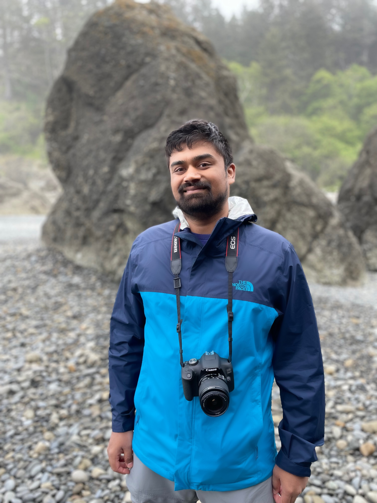

  

<!-- # Chandrasekaran Research Group -->

<h1 style="font-size: 1.5em; font-weight: bold;">Varun Chandrasekaran</h1>
Assistant Professor
 

    <a href="https://ece.illinois.edu/" target="_blank">
        Department of Electrical & Computer Engineering
    </a>

 

    <a href="https://siebelschool.illinois.edu/" target="_blank">
        Siebel School of Computing and Data Science
    </a>(affiliated)

 

    <a href="https://illinois.edu/" target="_blank">
        University of Illinois at Urbana-Champaign
    </a>

463 Coordinated Science Lab, 
1308 W Main St, Urbana, IL 61801 

<a href="mailto:varunc@illinois.edu"><i class="fa-solid fa-envelope fa-lg" style="color: #006BFF; margin: 2px"></i></a>
<a href="https://scholar.google.com/citations?user=Sl7nSOsAAAAJ&hl=en" target="_blank" rel="noopener noreferrer"><i class="fa-brands fa-google-scholar fa-lg" style="color: #006BFF; margin: 2px"></i></a>
<a href="https://x.com/varunchandrase3" target="_blank" rel="noopener noreferrer"><i class="fa-brands fa-twitter fa-lg" style="color: #006BFF; margin: 2px"></i></a>

---------------------------------

I am currently an Assistant Professor at the [University of Illinois at Urbana-Champaign](https://illinois.edu/), jointly appointed in the [Department of Electrical & Computer Engineering](https://ece.illinois.edu/) and affiliated with the [Siebel School of Computing and Data Science](https://siebelschool.illinois.edu/).

I obtained my Ph.D. in the Department of [Computer Sciences](https://www.cs.wisc.edu/) at the [University of Wisconsin-Madison](https://www.wisc.edu/), where I had the privilege of working with Prof. [Suman Banerjee](http://pages.cs.wisc.edu/~suman/) and Prof. [Somesh Jha](http://pages.cs.wisc.edu/~jha/). Prior to that, I completed my M.S. at the [Courant Institute of Computer Science](https://www.cs.nyu.edu/) at [New York University](https://www.nyu.edu/). I received my B.Eng. in Computer Science and Engineering from the [Anna University, Chennai, India](https://www.annauniv.edu/).

My research interests lie at the intersection of **Security & Privacy** and fields such as **Systems**, **Networking**, **Distributed Computing**, and **Machine Learning**. Specifically, my work focuses on understanding what private information can be inferred through interactions with machine learning models.

---------------------------------

## News

- **[09/2026]**: Our paper [Efficiently Attacking Memorization Scores](https://arxiv.org/abs/2509.20463) has been accepted by TMLR! Congratulations to all the authors!
- **[09/2026]**: Four papers have been accepted by NeurIPS 2026! Congratulations to all the authors!
  - [AgentAbstain: Do LLM Agents Know When Not to Act?](https://arxiv.org/abs/2607.10059) (Datasets & Benchmarks Track, Oral)
  - [You Can't Have It Both Ways: Concept Entanglement Limits Diffusion Model Unlearning](https://arxiv.org/abs/2609.34137)
  - [Systematic Scaling Analysis of Jailbreak Attacks in Large Language Models](https://arxiv.org/abs/2603.11149)
  - [Verifiers in the Loop: Decoding Time Verification for Code Translation](https://arxiv.org/abs/2605.17626)
- **[08/2026]**: Welcome PhD students Yian Wang, Yi (Evie) Zhang, and Vira Kasprova, and MS student Shengxin (Jack) Zhang to the group!
- **[08/2026]**: Two papers have been accepted by EMNLP 2026! Congratulations to all the authors!
  - [Validity-Aware Jailbreak Evaluation for Large Language Models](https://arxiv.org/abs/2609.00498)
  - [Do AI Reviewers Converge? Diversity Collapse in Model-Generated Peer Review](https://openreview.net/forum?id=NdDKcU9HlU) (Findings)
- **[04/2026]**: Our paper [Low-Compute Watermark Removal via Dual-Domain Natural Projection](https://arxiv.org/abs/2510.07538) has been accepted by ICML 2026! Congratulations to all the authors!
- **[04/2026]**: Our paper [SACTOR: LLM-Driven Correct and Idiomatic C to Rust Translation with Static Analysis and FFI-Based Verification](https://arxiv.org/abs/2503.12511) has been accepted by ACL 2026! Congratulations to all the authors!
- **[10/2025]**: Our project *Formally-Verified Compositional Lifting of C to Rust* has been funded by DARPA!
- **[10/2025]**: Our project *Toward More Pragmatic LLM Jailbreaking* has been funded by Open Philanthropy and the [Capital One Illinois Center for Generative AI Safety, Knowledge Systems, and Cybersecurity (ASKS)](https://asks.grainger.illinois.edu/)!
- **[08/2025]**: Welcome PhD students Pragati Meshram and Yiwei Fu, and MS student Xiangwen Wang to the group!
- **[07/2025]**: We have been awarded a [Google ML and Systems Junior Faculty Award](https://blog.google/innovation-and-ai/infrastructure-and-cloud/google-cloud/ml-systems-junior-faculty-awards/)! Congratulations to the group!
- **[01/2025]**: Our lab website is live!
