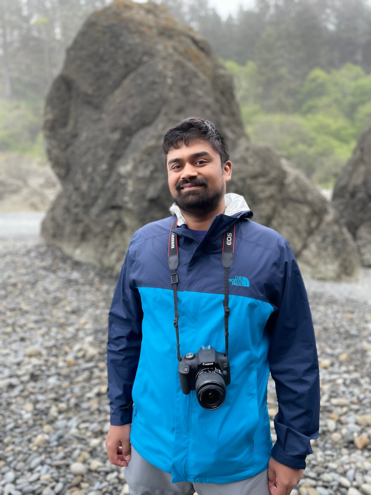

  

<!-- # Chandrasekaran Research Group -->

<h1 style="font-size: 1.5em; font-weight: bold;">Varun Chandrasekaran</h1>
Assistant Professor
 

    <a href="https://ece.illinois.edu/" target="_blank">
        Department of Electrical & Computer Engineering
    </a>

 

    <a href="https://siebelschool.illinois.edu/" target="_blank">
        Siebel School of Computing and Data Science
    </a>(affiliated)

 

    <a href="https://illinois.edu/" target="_blank">
        University of Illinois at Urbana-Champaign
    </a>

463 Coordinated Science Lab, 
1308 W Main St, Urbana, IL 61801 

<a href="mailto:varunc@illinois.edu"><i class="fa-solid fa-envelope fa-lg" style="color: #006BFF; margin: 2px"></i></a>
<a href="https://scholar.google.com/citations?user=Sl7nSOsAAAAJ&hl=en" target="_blank" rel="noopener noreferrer"><i class="fa-brands fa-google-scholar fa-lg" style="color: #006BFF; margin: 2px"></i></a>
<a href="https://x.com/varunchandrase3" target="_blank" rel="noopener noreferrer"><i class="fa-brands fa-twitter fa-lg" style="color: #006BFF; margin: 2px"></i></a>

---------------------------------

I am currently an Assistant Professor at the [University of Illinois at Urbana-Champaign](https://illinois.edu/), jointly appointed in the [Department of Electrical & Computer Engineering](https://ece.illinois.edu/) and affiliated with the [Siebel School of Computing and Data Science](https://siebelschool.illinois.edu/).

I obtained my Ph.D. in the Department of [Computer Sciences](https://www.cs.wisc.edu/) at the [University of Wisconsin-Madison](https://www.wisc.edu/), where I had the privilege of working with Prof. [Suman Banerjee](http://pages.cs.wisc.edu/~suman/) and Prof. [Somesh Jha](http://pages.cs.wisc.edu/~jha/). Prior to that, I completed my M.S. at the [Courant Institute of Computer Science](https://www.cs.nyu.edu/) at [New York University](https://www.nyu.edu/). I received my B.Eng. in Computer Science and Engineering from the [Anna University, Chennai, India](https://www.annauniv.edu/).

My research interests lie at the intersection of **Security & Privacy** and fields such as **Systems**, **Networking**, **Distributed Computing**, and **Machine Learning**. Specifically, my work focuses on understanding what private information can be inferred through interactions with machine learning models.

---------------------------------

## News

- **[07/01/2025]**: Our paper [[RealiTiCheck: A Real-Time Automated Fact-Checking System] has been accepted by CCS 2025! Congratulations to all the authors!
- **[07/01/2025]**: We have been awarded a [Google Research Scholar](https://research.google/programs-and-events/research-scholar-program/recipients/) award for our work on security and privacy! Congratulations to the group!
- **[05/15/2025]**: Our paper [Attention Speaks Volumes: Localizing and Mitigating Bias in Language Models](https://arxiv.org/abs/2410.22517) has been accepted by ACL 2025! Congratulations to all the authors!
- **[05/10/2025]**: Our paper [Not All Wrong is Bad: Using Adversarial Examples for Unlearning](https://arxiv.org/abs/2503.00917) has been accepted by ICML 2025! Congratulations to all the authors!
- **[01/22/2025]**: Our paper [Unearthing Skill-Level Insights for Understanding Trade-Offs of Foundation Models](https://arxiv.org/abs/2410.13826) has been accepted by ICLR 2025! Congratulations to all the authors!
- **[01/22/2025]**: Our paper [LOTOS: Layer-wise Orthogonalization for Training Robust Ensembles](https://arxiv.org/abs/2410.05136) has been accepted by ICLR 2025! Congratulations to all the authors!
- **[01/22/2025]**: Our paper [Generative Monoculture in Large Language Models](https://arxiv.org/abs/2407.02209) has been accepted by ICLR 2025! Congratulations to all the authors!
- **[01/19/2025]**: Our lab website is live!
